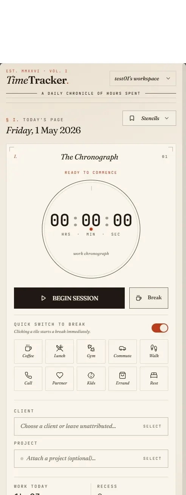

# TimeTracker

> A daily chronicle of hours spent — personal time tracking for you and your team, rendered as a printed ledger.

**Live:** <https://ttm.danielmoya.cv>

<p align="center">
  
</p>

---

TimeTracker is a small full-stack app for logging how you spend your day. It keeps a per-user ledger of sessions and breaks, groups them by customer and project, and renders everything as a chronograph dial + a paper ledger in an editorial "Almanac" aesthetic. Multiple members can share a workspace and keep independent ledgers.

## Features

### Time logging
- Chronograph-style timer with a sweeping second hand, monospace `HH:MM:SS` display, and a live note sublabel.
- Start / stop a work session, attributed to an optional **client → project** (cascading picker).
- **Inline slide toggle** under the start button reveals a grid of quick-break tiles (Coffee · Lunch · Gym · Commute · Walk · Call · Partner · Kids · Errand · Rest). Tapping a tile while a work session is running **cuts and switches** in one action.
- **Break quick-types with notes and icons** — pick from built-in tiles or save your own with a label + icon from a 17-glyph palette.
- Day ledger lists today's sessions as numbered ledger rows with per-row delete (with an "ink strike" AlertDialog).
- Calendar view with dotted markers on days that have entries.

### Organisation
- **Workspaces** with role-based membership (owner / admin / member) and token-based invitations.
- **Customers + projects** are shared catalogues across workspace members; projects may optionally tie to a customer.
- **Time entries and personal templates** are scoped to `(workspace, user)` — each member has an independent ledger, analytics, and invoices.

### Reporting & analytics
- Dashboard — today stats, week rollup, active timer, top customers, recent activity.
- Patterns — hourly + weekday productivity, break frequency.
- Insights — narrative summaries + recommendations.
- Custom reports with `day / week / month` grouping.
- This-week vs last-week period comparison with trend arrows.
- Per-customer weekly goal progress rings.
- Full-text search across entries with date-range, customer, project, and duration filters (paginated).

### Billing
- Monthly **PDF invoice generation** (PDFKit), rendered in the same editorial style as the web UI — masthead, ruled table, vermilion section labels, monospace duration column, italic colophon.

### Auth & session
- JWT auth with a 7-day expiry; bcrypt password hashing (cost 10).
- Client-side token-expiry check + 401 interceptor that signs the user out on the first stale response.
- Sign-out lives in the workspace menu (desktop) and the Members card (mobile).
- `express-rate-limit` on `/api/auth/*` and `/api/generate-invoice`.
- Zod schemas on every write endpoint.

### Real-time & progressive web app
- WebSocket (`ws` path) pushes dashboard events to open clients.
- PWA manifest + full icon set (favicon 32/192/512, apple-touch, maskable) — installs to the home screen.

### Design
- Mobile-first layout with a thumb-reachable bottom tab bar + an editorial masthead / tab rail from `sm:` up.
- Typography: **Fraunces** display serif, **Newsreader** body serif, **JetBrains Mono** for every numeric readout.
- Parchment palette with a single vermilion accent, hairline rules, and a very faint SVG-grain overlay.
- `prefers-reduced-motion` respected throughout.

## Architecture

```
┌──────────── internet ────────────┐
             │ 443
             ▼
  Nginx Proxy Manager
     (TLS · HTTP/2 · HSTS)
             │ http
             ▼
      ttm  (Node/Express)         ─── client: React + Vite + Tailwind
             │ postgres wire
             ▼
    ttm-db  (HeliosDB-Nano)       ─── persistent volume
```

Two containers on a private Docker bridge network, fronted by Nginx Proxy Manager with a Let's Encrypt certificate. The app is served over HTTPS, proxies `/api/*` and the `/ws` WebSocket path to the Node backend, and talks to HeliosDB-Nano over the standard PostgreSQL wire protocol.

### Tech stack

| Area | Choice |
|------|--------|
| Frontend | React 18 · TypeScript · Vite · Tailwind · shadcn/ui (Radix) · `@tanstack/react-query` |
| Charts | Recharts |
| PDF | PDFKit |
| Fonts | Fraunces · Newsreader · JetBrains Mono |
| Backend | Express 4 · TypeScript · Zod · `express-rate-limit` · `jsonwebtoken` · `bcryptjs` · `ws` |
| ORM | **`drizzle-orm/postgres-js`** |
| Driver | `postgres` (postgres-js) |
| Database | **HeliosDB-Nano** |
| Reverse proxy | Nginx Proxy Manager |
| Platform | Docker Compose on a single VPS |

### Data model

Nine tables across six migrations — see [`drizzle/`](./drizzle):

| Table | Scope |
|---|---|
| `users` | global |
| `workspaces`, `memberships`, `invitations` | per-workspace (with role) |
| `customers`, `projects` | **shared** across workspace members |
| `time_entries`, `entry_templates`, `invoices` | scoped to `(workspace, user)` |

## HeliosDB-Nano — drop-in Postgres, with a side-quest

TimeTracker uses **[HeliosDB-Nano](https://github.com/Dimensigon/HDB-HeliosDB-Nano)** as its operational database. HeliosDB-Nano is a single-binary embedded database that speaks the PostgreSQL wire protocol (plus MySQL and HTTP REST), storing data in a RocksDB-style layout at rest. It has persistence, `SERIAL`/`IDENTITY` columns, FK constraints, pg_catalog views, `extract(epoch from ...)`, window functions, and the rest of the PG surface a typical ORM expects.

The app connects via a standard `postgres-js` + `drizzle-orm/postgres-js` setup — **no custom driver, no adapter shim, no HeliosDB-specific code paths in the application.** The [`db/connection.ts`](./db/connection.ts) file is six lines long.

### Drizzle-ORM compatibility

This project doubled as an integration test of HeliosDB-Nano against an unmodified Drizzle-ORM stack. We deployed an everyday React + Drizzle + postgres-js codebase, gave it no HeliosDB-aware workarounds, and filed bugs on everything the server got wrong vs stock PostgreSQL 16. The Nano team closed 36 compatibility bugs across nine releases (`3.14.0 → 3.14.10`):

| Area | Releases |
|------|----------|
| `SERIAL` / `IDENTITY` auto-increment, `DEFAULT` in VALUES, `RETURNING *` wire format | 3.14.0 / 3.14.3 / 3.14.4 |
| Extended-query protocol (`Parse`/`Bind`/`Execute`/`Flush`), `pg_catalog.pg_type` introspection, catalog `WHERE` filters | 3.14.1 / 3.14.2 |
| `NOT NULL` enforcement parity across INSERT paths; `DEFAULT now()` evaluation; `INSERT … DEFAULT VALUES` | 3.14.3 |
| `extract(epoch from ts-ts)`, timestamp wire encoding, date/time comparison, ISO-string → timestamp coercion | 3.14.2 / 3.14.5 / 3.14.7 |
| Stale `result_cache` after `INSERT RETURNING` (the sneaky one: parallel reads returning `[]` after a fresh write) | 3.14.6 |
| UPDATE/DELETE with a table-qualified `WHERE` column; parameterized `LIMIT`/`OFFSET`; UPDATE SET coercion | 3.14.7 / 3.14.8 |
| Mixed qualifier styles across SELECT list vs GROUP BY; DATE group-key comparison | 3.14.9 |
| FK validation with quoted target identifiers (closed the last orphan-row data-integrity hole) | 3.14.10 |

End state: **TimeTracker runs on HeliosDB-Nano 3.14.10 with idiomatic Drizzle — no `sql.unsafe()` escape hatches, no manual SQL, no ORM-level workarounds.** The full bug list with verbatim reproducers and resolution notes lives upstream in the HeliosDB-Nano repo as `BUGS_TIMETRACKER_DRIZZLE_COMPAT.md`.

If you want to run your own Drizzle (or Prisma / TypeORM / SQLAlchemy / etc.) app on Nano today, you inherit all of the above — every fix landed on `main`.

## Running it

### Development

```bash
# Clone, install, start Vite dev server + API
npm install
npm run dev
```

The dev server proxies `/api/*` to `http://0.0.0.0:3001` (see [`vite.config.ts`](./vite.config.ts)). The backend needs a running HeliosDB-Nano (or any Postgres) on `DATABASE_URL`.

### Production (single-host Docker)

Environment variables for the application container:

| Env | Purpose |
|---|---|
| `DATABASE_URL` | `postgres://postgres@ttm-db:5432/heliosdb` |
| `DATABASE_SSL` | `false` on a private Docker network |
| `JWT_SECRET` | 32-byte random, base64 |
| `NODE_ENV` | `production` |
| `PORT` | `3001` |

Build and deploy both containers (application + HeliosDB-Nano) on the same Docker network, fronted by whichever reverse proxy you like. The full operational manual lives in [**`SERVICE.md`**](./SERVICE.md) — component inventory, migration runbook, rollback matrix, secrets inventory, backup plan.

## Repository layout

```
.
├── client/                  React + Vite frontend (editorial "Almanac" theme)
│   ├── index.html           Vite entry, favicon + manifest links
│   ├── public/              Favicon set + web manifest (served verbatim)
│   └── src/                 Components, pages, hooks, lib
├── server/                  Express + Drizzle backend
│   ├── routes.ts            Core CRUD (users, customers, projects, time entries, invoice)
│   ├── auth.ts              Register / login / JWT middleware
│   ├── workspaces.ts        Workspace + membership + invitation routes
│   ├── projects.ts          Project CRUD (FK to customers)
│   ├── templates.ts         Entry-template CRUD (break quick-types with icons)
│   ├── bulk-operations.ts   Bulk update / delete / export / statistics
│   ├── advanced-features.ts Search, dashboard, patterns, reports
│   ├── productivity-insights.ts
│   ├── notifications.ts
│   ├── websocket.ts         /ws real-time event push
│   ├── validation.ts        Zod schemas for every POST/PATCH
│   ├── rate-limit.ts        express-rate-limit config
│   └── index.ts             Server bootstrap
├── db/
│   ├── schema.ts            Drizzle schema (canonical source of truth)
│   ├── connection.ts        postgres-js client (six lines)
│   └── migrate.ts           Migration runner
├── drizzle/                 SQL migrations (0000 → 0005)
├── Dockerfile               Multi-stage build (Vite + esbuild → Node 20 Alpine)
├── SERVICE.md               Operations / deployment manual
└── README.md
```

## License

MIT — do what you like. Attribution appreciated but not required.
